# rpgstats mockup navigation

There are placed _.penpot_ format mockups and images used for UI

## How to open mockups?

* Sign in on [_https://penpot.app/_](https://penpot.app/) site
* Download necessary file from [**penpot-file**](penpot-files) directory
* Import this file into your workspace
* Open imported file to navigate through screens

_Optional:_ 

If you want to experience clickable screens you can click on button *View mode* in the upper right corner (G + V key combination), click on *Interactions* drop down on upper panel and choose *Show Interactions* to see where is clickable elements. Enjoy!

*_ATTENTION:_*

Some icons could not be seen if you have light theme on github.

## Used components
There is structural fraction of images depends on its purpose, user role and etc.

It should help team's android developers to navigate through images used in UI easier:

* _There are pictures used for buttons:_ [**components/buttons**](components/buttons)

	* [**Add Check**](components/buttons/add_check.png) 
     
	* [**Add Plus**](components/buttons/add_plus.png) 
    
	* [**Back**](components/buttons/back.png) 
     
	* [**Dark Cancel**](components/buttons/cancel_dark.png) 
     
	* [**Light Cancel**](components/buttons/cancel_light.png) 
     
	* [**Copy**](components/buttons/copy.png) 
     
	* [**Download**](components/buttons/download.png) 
     
	* [**Drop Down**](components/buttons/drop_down.png) 
     
	* [**Dark Edit**](components/buttons/edit_dark.png) 
     
	* [**Light Edit**](components/buttons/edit_light.png) 
     
	* [**Export**](components/buttons/export.png) 
     
	* [**Fork**](components/buttons/fork.png) 
  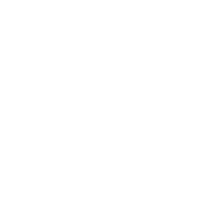   
	* [**Github**](components/buttons/github.png) 
     
	* [**Google Plus**](components/buttons/google_plus.png) 
     
	* [**Invite**](components/buttons/invite.png) 
     
	* [**Menu**](components/buttons/menu.png) 
     
	* [**Next**](components/buttons/next.png) 
     
	* [**Trash**](components/buttons/trash.png) 
     
	* [**Upload**](components/buttons/upload.png) 
     

* _There are pictures used for navigation panel:_ [**components/navigation-panel**](components/navigation-panel)

	* [**Info**](components/navigation-panel/info.png) 
     
	* [**Search**](components/navigation-panel/search.png) 
     
	* [**Items**](components/navigation-panel/items.png) 
     
	* [**NPC**](components/navigation-panel/npc.png) 
     
	* [**Tags**](components/navigation-panel/tags.png) 
  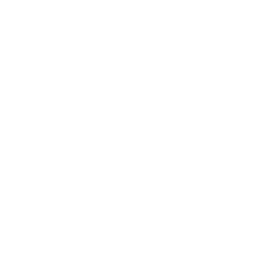   
	* [**Parameters**](components/navigation-panel/parameters.png) 
     

* _There are pictures used for item icons in item list:_ [**components/item-icons**](components/item-icons)

	* [**Arbalest**](components/item-icons/arbalest.png) 
  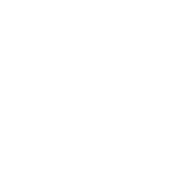   
	* [**Bow**](components/item-icons/bow.png) 
     
	* [**Brew**](components/item-icons/brew.png) 
  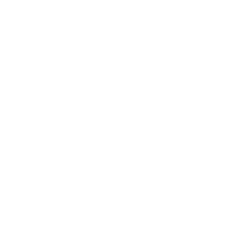   
	* [**Armor**](components/item-icons/armor.png) 
     
	* [**Book**](components/item-icons/book.png) 
     
	* [**Boots**](components/item-icons/flying_boots.png) 
     
	* [**Gem**](components/item-icons/gem.png) 
     
	* [**Hammer**](components/item-icons/hammer.png) 
     
	* [**Money Bag**](components/item-icons/money_bag.png) 
     
	* [**Potion**](components/item-icons/potion.png) 
     
	* [**Shield**](components/item-icons/shield.png) 
     
	* [**Sword**](components/item-icons/sword.png) 
     
	* [**Empty Slot**](components/item-icons/empty_slot.png) 
     

* _There are pictures used for icons:_ [**components/icons**](components/icons)

	* [**Master Icon**](components/icons/master_icon.png) 
  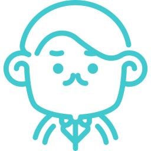   
	* [**Game System Icon**](components/icons/game_system_icon.png) 
  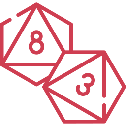   
	* [**Camera Icon**](components/icons/camera.png) 
     
	* [**Player Icon**](components/icons/player.png) 
  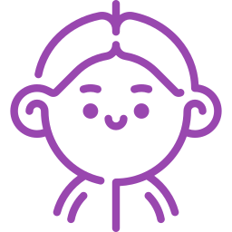   
	* [**Character Icon**](components/icons/character.png) 
  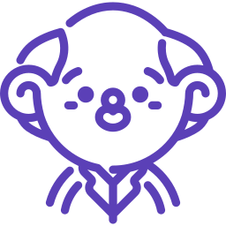   

* _There are pictures used for backgrounds:_ [**components/backgrounds**](components/backgrounds)

	* [**Login Background**](components/backgrounds/login_background.png) 
     
	* [**Master Background**](components/backgrounds/master_background.jpg) 
     
	* [**Add Game System Background**](components/backgrounds/add_game_system_background.jpg) 
  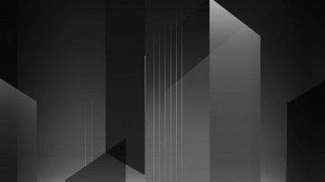   
	* [**Game System Background**](components/backgrounds/game_system_background.png) 
  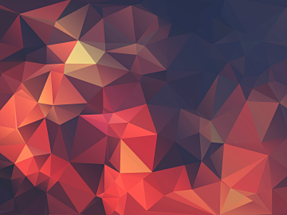   
	* [**User Background**](components/backgrounds/user_background.jpg) 
  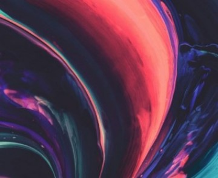   
	* [**Character Background**](components/backgrounds/character_background.jpg) 
  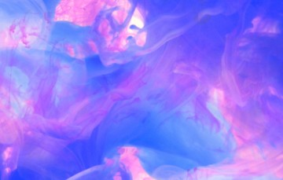   

